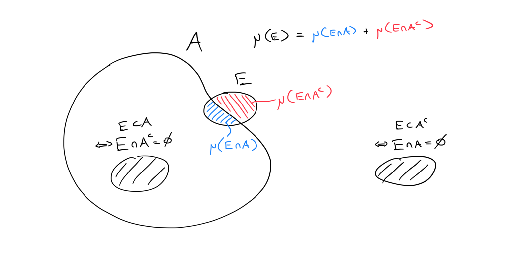

My gap between learning this definition and actually making (at least some) sense of it was longer than I usually have with situations in analysis. Here's one thing I've come up with to explain what it's trying to do.

$$
\mu(E) = \mu(E\cap A) + \mu(E\cap A^c)
$$

Officially: we start with an outer measure $$\mu$$. All of this is defined for the abstract setting, but you can just picture the story in $$\R^n$$ if you've heard it. Here the outer measure approximates the size of any set using something with an easy shape like euclidean boxes to cover sets and measures the size of those instead. It uses finer boxes to get a better approximation.

But allowing *all* sets is bad, there are problematic sets out there. Apparently. Actually, I don't know so much about the problems/paradoxes that show up, but this is ringing a Banach-Tarski bell. In any case, they must involve non-measurable sets. We restrict $$\mu$$ to only measure measurable sets. A set $$A$$ is called *measurable* if, for every set $$E$$, it satisfies the "splitting" equality $$(\ref{eq:1})$$ above. In fact by subadditivity, one inequality ($$\leq$$) is always true. So the nontrivial property for measurable sets is that

$$
\mu(E) \not< \mu(E\cap A) + \mu(E\cap A^c).
$$

Think of $$E$$ as a "testing" set. We have a fixed set $A$, the measurability of which we want to test using different sets $$E$$. If we picked a test set with infinite measure, then the condition is easily satisfied. So this should suggest that we should be using finite measure sets, and **testing small, local properties** of $$A$$. 

So what could go wrong, or rather, *where* could something go wrong? The criterion involves both $$E\cap A$$ and $$E\cap A^c$$. If either of these is empty, then we again have full equality. So we should be **testing the boundary** of $$A$$. And something could go wrong if the boundary is really bad somewhere. 

When something is "really bad" in analysis, it could be blowing up to infinity or possibly be oscillating like crazy. Consider the latter, a set with really bad "teeth". If we place a test set right over the teeth, we can see why we might get an inequality when measuring the split sets.

Remember that we're using an outer measure. If the oscillation is truly terrible, it's hard to get boxes into the teeth that are able to distinguish the inside of $$A$$ from the outside. We are forced to overestimate both regions, which leads to a strict inequality precisely at the teeth.

Why did it take me so long to figure this out? Well first, I was already in a position of not liking measure theory. Most people I know don't like measure theory. The counter examples are weird, and there are so many techniques that are needed to learn, it's overwhelming and disgusting. So I wasn't about to sit down and daydream (how this usually works) about which sets we want to label measurable or non-measurable.

It was also good that I waited until after I had seen the concept of "test functions" in PDE's. These are usually smooth functions with compact (and very concentrated) support ($\varphi\in C_c^\infty$), with which we can examine the properties of other, less regular functions.

As an example, consider weak derivatives in PDE's. A function $$u$$ may not be differentiable, but what if there was a function $$v$$ which satisfies the integration by parts formula: For every test function $$\varphi$$,

$$
-\int u\varphi' = \int v \varphi.\label{eq:ibp}
$$

If $$u$$ was differentiable, then $$v=u'$$ satisfies this formula by actual integration by parts (the boundary term disappears because $$\varphi$$ has compact support). So in general we call $$v$$ the **weak derivative** of $$u$$ (and we still write $$v=u'$$).

There are indeed some weakly-but-not-strongly-differentiable functions, like this angular function:

$$
\psi(x) = \begin{cases}0 & \text{for negative $x$} \\x & \text{for positive $x$}\end{cases} \nonumber
$$

But not every function has a weak derivative. Like the step function:

$$
\theta(x) = 
\begin{cases}
0 & \text{for negative $x$} \\
1 & \text{for positive $x$}
\end{cases} \nonumber
$$

In fact $$\theta = \psi'$$ (weakly), which you might intuit. To show that $$\theta$$ has no weak derivative, we will suppose one exists, and then use test functions to look closely at what happens around $$x=0$$.

Define a sequence of test functions $$\varphi_n$$ which "concentrate" around $$x=0$$:

$$
\varphi_n(0) = 1, \qquad \text{support}(\varphi_n) \subseteq \left[-\frac{1}n,\frac1n\right]
\nonumber
$$

One can imagine smoothing out iscoceles triangles, with shrinking widths and constant height 1, to get a sequence of "narrowing bumps". 

The integration by parts equation $(\ref{eq:ibp})$ then becomes (considering the supports):

$$
-\int_{-\frac1n}^{\frac1n} \theta\varphi_n' = \int_{-\frac1n}^{\frac1n} \theta' \varphi_n 
\nonumber
$$

The left side is in fact always 1.
$$
-\int_{-\frac1n}^{\frac1n}\theta\varphi_n' = -\int_0^{\frac1n}\varphi_n' = -\varphi_n(1/n) + \varphi_n(0) = \varphi_n(0) = 1
\nonumber
$$
Meanwhile on the right side, the integrand is bounded by the constant 1. And because of their shrinking supports, the test functions are limiting pointwise (almost everywhere) to the constant 0 function. So by a (bounded or dominated) convergence theorem, we have
$$
\nonumber
\int \theta'\varphi_n \longrightarrow 0,
$$
which is a contradiction. 

Again, notice how we used the concentrating test functions to focus on the discontinuity of $\theta(0)$.
